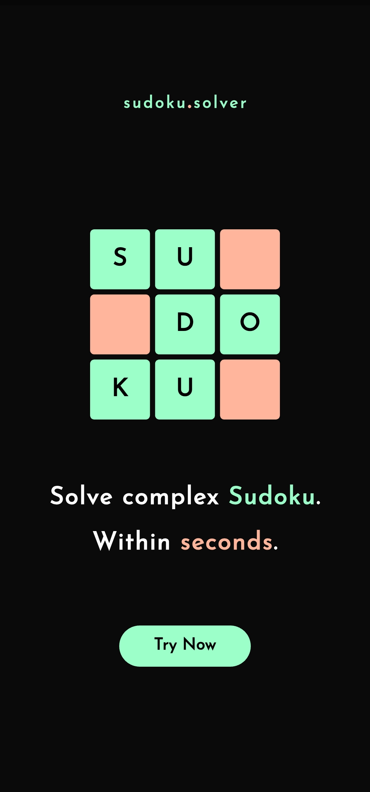
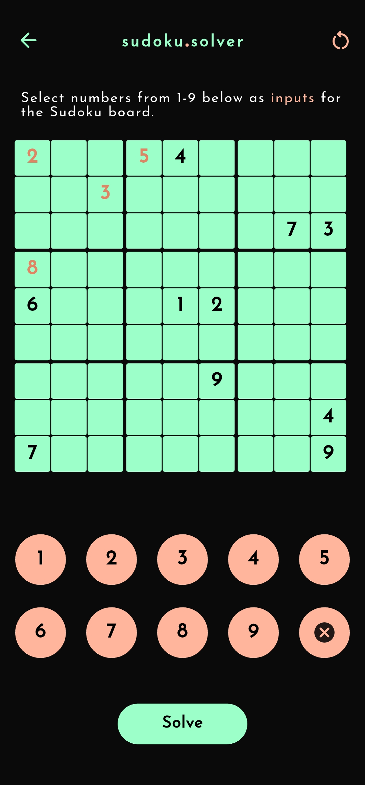
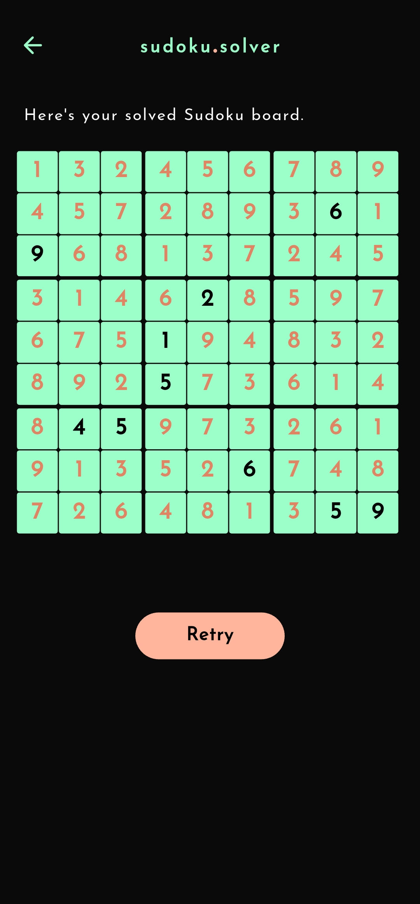

# Sudoku Solver

A simple and fun Sudoku game made with Flutter, featuring a clean and minimal design.

## ✨ Features

- Interactive Sudoku grid UI
- Google Fonts for custom typography
- Lightweight and responsive design

## 🚀 Getting Started

### Prerequisites

- [Flutter SDK](https://flutter.dev/docs/get-started/install) (version ^3.8.0)
- An Android/iOS device or emulator

### Installation

1. **Clone the repository**

   ```bash
   git clone https://github.com/your-username/sudoku_solver.git
   cd sudoku_solver

   ```

2. **Install dependencies**

   ```bash
   flutter pub get
   ```

3. **Run the app**

   ```bash
   flutter run
   ```

## 📸 Screenshots

  
